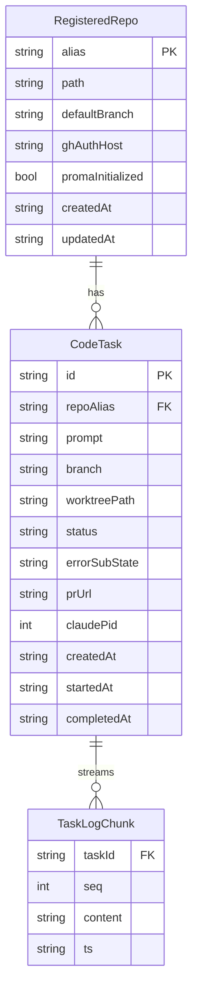

# ✨ Multi-Repo Claude Code Orchestrator with Per-Repo proma PM

## Enhancement Summary

**Deepened on:** 2026-05-16
**Sections enhanced:** Architecture, Security, TypeScript Design, Performance, State Machine, Frontend Races, Agent-Native Parity, UI, Testing, Scope.
**Agents consulted (12, all model=sonnet, parallel):** `architecture-strategist`, `security-sentinel`, `code-simplicity-reviewer`, `kieran-typescript-reviewer`, `performance-oracle`, `agent-native-reviewer`, `julik-frontend-races-reviewer`, `pattern-recognition-specialist`, plus skill-appliers for `frontend-design`, `agent-native-architecture`, `agent-harness-construction`, `e2e-testing`.

### Headline changes folded in (must-do for implementer)

1. **Per-task IPC channel** (`code:taskChunk:${taskId}` not shared) — eliminates cross-task chunk leakage and listener-clobber on unmount. (julik-races, race #1)
2. **Discriminated union for `CodeTaskState`** with collapsed `{status: 'error', code: AppErrorCode, detail: string}` — replaces 9 flat error sub-states; satisfies both type-safety (kieran-ts) and simplicity-reviewer cut. Best-of-both resolution.
3. **`Result<T, AppError>` envelope at module boundaries**; throw only for programming errors; Zod validation at exactly one place (`ipcMain.handle` entry). (kieran-ts #4, #5)
4. **Chunk batching with rAF throttle in renderer + virtualization for >5K-line logs** — without this the renderer freezes on a 10-min task. (performance-oracle #1)
5. **`-c core.hooksPath=NUL`** on every git command operating against a registered repo — prevents arbitrary code execution from a hostile repo's `post-checkout` hook. (security-sentinel rec #1)
6. **`fs.realpath()` + symlink rejection** in `repos:register` — prevents `evil → /etc` traversal. (security-sentinel rec #3)
7. **Per-repo write permission check** via `gh api repos/{owner}/{repo}` asserting `permissions.push: true` — surfaces auth issues at registration, not after 30 min of agent work. (security-sentinel rec #4)
8. **DOMPurify config locked down** — `ALLOWED_TAGS` whitelist, no `style`/`class`/`data-*` — `rehype-sanitize` defaults still permit CSS injection. (security-sentinel rec #5)
9. **Cancellation tokens on all timers + `webContents.isDestroyed()` guard before every `send`** — required before app-quit cleanup is safe. (julik-races #4, #5)
10. **Extract `registerCodeHandlers(mainWindow)`** to a new `ipc-handlers/code.ts` slice — `ipc-handlers.ts` is already 1,427 lines, violates the 800-line ceiling. (pattern-recognition #5)
11. **`pr-watcher` emits typed events only**; `code-tasks` is sole state-machine authority. (architecture #1)
12. **Avoid the `code-tasks ↔ worktree-manager` import cycle** via injected `killFn` callback. (architecture #5)

### Scope decisions (YAGNI vs production — explicit choices for the implementer)

These were flagged as candidates to cut by simplicity-reviewer. I'm carrying forward all of them with explicit demo-vs-prod gating:

| Item | Demo necessity | Decision |
|---|---|---|
| Stream buffer cap + temp-file overflow | Not needed for a 60s demo | **Defer to phase 3.** Cap in-memory at 5MB and abort the task if exceeded — simpler than file rotation. |
| Activity timeout (5-min stdout silence) | Useful but not essential | **Keep** — protects against runaway costs even in demo. Cheap to implement. |
| Exponential backoff on gh rate limit | Demo won't hit limit | **Defer to phase 3.** Linear 60s polling is fine at < 30 repos. |
| Startup reconciliation of orphan worktrees | Crash-recovery, not demo path | **Keep minimal version** — on boot, scan `userData/data/worktrees/` and surface unknown dirs as "Discard?" only (no auto-resume). Full resume support is phase 3. |
| Per-repo proma installer as its own module | Could be inlined | **Keep as `proma-installer.ts`** — separate file keeps the install logic testable in isolation; trims to ~50 lines. |
| Two preflight modes (boot vs registration) | Same code path | **Merge into one** `preflight(repoPath?)` function. Adopted from simplicity #3. |

### New surfaces added by deepening (no longer optional)

- **Agent-native parity gaps** were severe. The plan now adds: `code:resume({taskId})` IPC, `code:getTaskLog({taskId, offset, limit})`, `proma:writeFile({alias, file, content})`, and a **local MCP server** (`src/main/mcp-server.ts`) fronting all `repos:*` / `code:*` / `proma:*` operations. Without these, Claude itself cannot drive its own orchestrator. (agent-native-reviewer #1-#5, agent-native-architecture skill #1-#5)
- **`complete_task` tool** for explicit agent-declared completion (vs. heuristic exit-code-0 + non-empty-diff detection). Removes a class of false negatives. (agent-harness-construction skill #1, agent-native-architecture skill #1)
- **Tool-call timeline** in each task card — parse `stream-json` `tool_use` / `tool_result` events; show "wrote 3 files, ran 1 bash, opened PR" as a collapsible inline trace. (agent-native-architecture skill #5)
- **`src/types/ipc.ts`** as the shared IPC contract module — imported by main, preload, and (via the existing `types/` convention) the renderer. (kieran-ts #2)

### New considerations discovered (informational)

- `claude-runner.ts` already exists at 1,427 lines for `ipc-handlers.ts` — the planned Code-tab additions push it over even more. The plan now mandates an extraction-first commit before adding any new handlers.
- proma's `tick-check.js` SessionStart hook requires `node` in the spawned PATH; under Electron on Windows with nvm/fnm, this may not be inherited. Preflight must cover it.
- `claude -p` exit code 1 maps to many error classes; the only reliable disambiguation is parsing `stream-json` for `system/api_retry` events with their `error` field. Plan now mandates capturing that.
- Frontend tabbed proma drawer (TODO / PROGRESS) is cheaper than rendering both inline — adopted from frontend-design.

The detailed agent-by-agent recommendations are in § Deepening Insights below; the original phases and acceptance criteria above are amended in-place to reflect must-do changes.

---

## Overview

Add a new top-level **Code** tab to the SecondBrain Electron app that lets the user dispatch Claude Code (`claude -p`) tasks against any registered local git repository. Each task runs in an isolated git worktree on a dedicated branch (`agent/task-<id>`), Claude works autonomously, commits, and opens a PR via `gh pr create`. SecondBrain polls per-repo for PR-merge events and auto-cleans the worktree on detected merge. Per-repo [proma](https://github.com/dpraj007/proma) (a markdown-based PM Claude Code plugin) is initialized on registration so PM state (`TODO.md`, `PROGRESS.md`, `ROADMAP.md`, `BACKLOG.md`, `INBOX.md`, `decisions/`) survives across sessions and ships with the code in git.

Telegram dispatch is **explicitly phase 2** and out of scope for this plan — the same IPC handlers built here will be reused by an extended `command-queue.ts` routing type when phase 2 lands.

## Problem Statement

Today `src/main/claude-runner.ts` already spawns `claude -p` subprocesses, but always against the SecondBrain repo itself (default `cwd = app.getAppPath()`). There is no surface for the user to direct Claude at any other codebase, no isolation between concurrent agent runs, no persistent PM state that survives compaction or session restarts, and no PR-gated approval rail. The user wants to "code on the desktop from anywhere or interact with the app" — but the first concrete demo target is a local desktop UI, not Telegram, because that is what they can show off without remote infrastructure (see brainstorm: `docs/brainstorms/2026-05-16-multi-repo-claude-orchestrator-brainstorm.md`).

The feature also has a critical secondary purpose: it establishes the architectural pattern for **agent-native cross-repo orchestration** that the rest of SecondBrain will adopt over time (Telegram dispatch in phase 2, scheduled agent runs in phase 3, etc.). Getting the worktree + IPC + streaming + PR-watcher primitives right now pays compounding dividends.

## Proposed Solution

A new top-level **Code** tab in the renderer surfaces:
- A left sidebar of registered repos (with `+ Register repo` button)
- A center pane with a new-task composer (repo dropdown + prompt textarea + Run) and a live-streaming output log for the currently selected task
- A right rail of active task cards (branch name, status, PR link, Discard button)
- A bottom drawer that renders the selected repo's proma `TODO.md` / `PROGRESS.md` on demand

The main process gains six new modules and one new SessionStart hook variant. Streaming uses `claude -p --output-format stream-json --verbose --include-partial-messages` over a `node-pty` PTY (workaround for the documented stdout block-buffering bug in piped stream-json — Claude Code issue #25670). Worktrees live under `app.getPath('userData')/data/worktrees/<alias>/task-<id>/` to avoid colliding with the existing `detectWorktree()` startup-check that watches `.claude/worktrees/` in the main repo (see `src/main/startup-checks.ts:48`).

Per-repo proma is installed once globally in `~/.claude/plugins/proma/` (verified at registration time) and `/proma:init` is dispatched into each new repo via a short bootstrap `claude -p` call. The proma scaffolding is then committed and pushed by SecondBrain (proma's init does **not** commit — it only writes files).

PR-gated approval relies on `gh pr create` for opening and `gh api repos/{owner}/{repo}/pulls/{number}` (single-loop-per-repo polling, 60s interval) for merge detection. Cleanup follows the documented safe ordering to avoid the catastrophic-data-loss class of bug (Claude Code issue #48927): detect merged → `git merge-base --is-ancestor` (with squash/rebase fallback to GitHub's `mergedAt`) → `git worktree remove` (clean) → `git branch -d` (not `-D`) → `git worktree prune`.

## Technical Approach

### Architecture



**Module boundaries**

- `src/main/registered-repos.ts` — JSON-backed CRUD over `app.getPath('userData')/data/registered-repos.json` (single-file array, **not** per-item files). Modeled on `src/main/projects.ts:1-80` but flattened to one file (small N, simpler atomics).
- `src/main/worktree-manager.ts` — `git worktree add/remove/prune`, per-repo `AsyncMutex` (invariant I-1: at most one `git worktree add` per repo at a time), path-traversal validation (invariant I-8). No prior art in `src/` for shelling out to git — establishes the pattern.
- `src/main/code-tasks.ts` — task lifecycle, state machine, in-memory registry of `Map<taskId, ChildProcess>` consulted on `app.before-quit` (invariant I-7).
- `src/main/claude-runner.ts` (extend) — add `runClaudeInWorktree(alias, prompt, taskId, onChunk)` after `runClaudeCodeIngest` at line 210. Existing `spawnClaude` already supports `cwd` and `extraEnv` (`src/main/claude-runner.ts:33-174`); we add an optional `onChunk?: (chunk: string) => void` to `RunOptions` and wire stdout-data emission. Set `SECONDBRAIN_SESSION_MODE=external` and **delete `SECONDBRAIN_ROOT`** from `extraEnv` so the SessionStart hook in the foreign repo cannot try to load SecondBrain identity files from the wrong cwd.
- `src/main/pr-watcher.ts` — single timer per repo (invariant I-6), 60s default, exponential backoff when `X-RateLimit-Remaining` < 200 (invariant I-5). Distinguishes "PR not yet created" (normal in `running`) from "creation failed."
- `src/main/preflight.ts` — at app boot and at registration: `gh auth status --json hosts` (parse JSON for token scopes; `repo` write is required), `where.exe claude` on Windows to detect the App Execution Alias shadow (Claude Code issue #24903), `node --version` for proma's `tick-check.js` SessionStart hook, `~/.claude/plugins/proma/` existence check.
- `src/main/proma-installer.ts` — clones or symlinks `https://github.com/dpraj007/proma` into `~/.claude/plugins/proma/` once globally; `runClaudeInWorktree` to call `/proma:init` in a new repo; commit + push the proma scaffolding under a single bot identity (`SecondBrain Agent <agent@secondbrain.local>` configured per-worktree via `git -c user.name=... -c user.email=...` so the global user identity is untouched).
- `scripts/claude-hooks/session-start-inject.sh` (extend) — add a third branch (line 29-area) routing `SECONDBRAIN_SESSION_MODE=external` to a new `session-start-inject-external.sh` stub that emits only a tiny systemMessage with repo path and task ID, never the 10K Tier 1 Amy identity load.
- `src/main/ipc-handlers.ts` (extend) — new namespaces `repos:*`, `code:*`, `proma:*` adjacent to the existing `projects:*` block at line 529. Streaming uses the established `mainWindow.webContents.send(channel, payload)` pattern at line 130 — already used by `chat:delta` at line 374 and `studio:progress` at line 1309-1370.
- `src/preload/index.ts` (extend) — expose `window.api.repos`, `window.api.code`, `window.api.proma` following the namespaced object pattern at lines 41-54 (`import` namespace as the template).
- `src/renderer/src/pages/Code.tsx` — new page. Dark theme `#0f0f0f` bg / `#111` sidebar per `src/renderer/src/App.tsx:241,263`.
- `src/renderer/src/App.tsx` — add `'code'` to the `Page` union at line 72, add nav item at line 89, mount in render at line 326.

### Implementation Phases

#### Phase 1: Foundation (storage, worktree, runner extension, hook)

**Goal:** Backend primitives are testable in isolation. No UI yet.

- Add `node-pty` dependency; verify `electron-rebuild` rebuilds it against Electron's ABI in the existing `postinstall` script. Risk-1 mitigation.
- Implement `preflight.ts` — exports `checkGhAuth(host)`, `checkClaudeAlias()`, `checkNode()`, `checkPromaInstalled()`. Each returns `{ok: true}` or `{ok: false, code, message, remediationUrl?}`.
- Implement `registered-repos.ts` — schema: `{alias, path, defaultBranch, ghAuthHost, promaInitialized, createdAt, updatedAt}`. CRUD functions named `listRepos`, `getRepo`, `registerRepo`, `unregisterRepo`. Sort by `updatedAt desc` (mirrors `projects.ts:54`).
- Implement `worktree-manager.ts` with:
  - `createWorktree(alias, taskId): Promise<string>` — acquires per-repo `AsyncMutex`, validates `.git` not a worktree itself, runs `git fetch origin <defaultBranch>`, creates branch `agent/task-<id>` off `origin/<defaultBranch>`, returns absolute worktree path under `userData/data/worktrees/<alias>/task-<id>/`.
  - `discardWorktree(taskId)` — validates path is subdir of known worktree root (invariant I-8), kills child if registered, runs `git worktree remove`, `git branch -d`, `git worktree prune`.
  - `listActiveWorktrees()` — for startup reconciliation.
- Extend `claude-runner.ts`:
  - Add `onChunk?: (chunk: string) => void` to `RunOptions`.
  - Wire stdout-data handler in `spawnClaude` to call `onChunk` per chunk **in addition to** accumulating into the existing return string. ANSI escape codes are absent from `stream-json` output, so no stripping needed at this layer.
  - Add `runClaudeInWorktree(alias, prompt, taskId, onChunk)` after line 210 — sets `SECONDBRAIN_SESSION_MODE=external` and `delete extraEnv.SECONDBRAIN_ROOT`, spawns via PTY using `node-pty` (Windows stdout buffering workaround for Claude Code issue #25670), with `--output-format stream-json --verbose --include-partial-messages` flags.
- Create `scripts/claude-hooks/session-start-inject-external.sh` — emits `systemMessage` with only `Repo: <path>` and `Task ID: <id>`. Wire routing in `session-start-inject.sh:29` area as a third `if` branch.
- Tests in `tests/`:
  - `registered-repos.spec.ts` — CRUD, persistence, sort order.
  - `worktree-manager.spec.ts` — create/discard, mutex serialization, path-traversal rejection (`createWorktree('alias', '../../etc/passwd')` must fail).
  - `claude-runner-streaming.spec.ts` — extend existing mocking pattern at `src/main/__tests__/claude-runner-ingest.test.ts:23-46` to verify `onChunk` fires per stdout chunk.

**Success criteria:** All Phase 1 unit tests pass. `runClaudeInWorktree` can be invoked from a node REPL and produces streamed JSON deltas.

**Estimated effort:** 1.5 days.

#### Phase 2: Core Implementation (IPC + UI + state machine + PR lifecycle)

**Goal:** End-to-end happy path demo. Register a repo → run a task → see streaming output → click the PR link.

- Extend `ipc-handlers.ts` with namespaced handlers (alongside `projects:*` at line 529):
  - `repos:list`, `repos:register({path})`, `repos:unregister({alias})`
  - `code:run({alias, prompt}) → {taskId}`, `code:listTasks() → Task[]`, `code:getTask({taskId})`, `code:discard({taskId})`
  - Streaming via `mainWindow.webContents.send('code:taskChunk', {taskId, chunk})` and `code:taskStatus` (status transitions). Pattern cloned from `chat:delta` at `src/main/ipc-handlers.ts:374-382`.
- Implement `code-tasks.ts` state machine. Legal states: `queued | running | awaiting-pr | merged | discarded | error`. Error sub-states: `auth-error | billing-error | rate-limit-error | claude-failed | push-failed | gh-failed | interrupted | branch-overwritten | closed-unmerged | empty-diff`. Transitions are described under § State Machine below.
- Implement `proma-installer.ts`:
  - `ensureGlobalProma()` — clones `dpraj007/proma` to `~/.claude/plugins/proma/` if missing.
  - `initRepoProma(alias)` — dispatches `claude -p "/proma:init"` into the repo (NOT a worktree — proma init runs on `main` directly), then `git -c user.name='SecondBrain Agent' -c user.email='agent@secondbrain.local' add proma/ && commit -m "chore(proma): initialize PM scaffolding" && push`.
- Implement `pr-watcher.ts`:
  - One `setInterval` per repo with at least one `awaiting-pr` task.
  - Each tick calls `gh api repos/{owner}/{repo}/pulls/{number} --jq '{state, mergedAt, merged}'` once; fans result out to all watching tasks for that repo.
  - On `mergedAt != null`: run safe cleanup sequence; fire `code:taskStatus` IPC event with `merged`.
  - On `state=CLOSED && mergedAt=null`: flip to `error(closed-unmerged)`.
  - Exponential backoff when `X-RateLimit-Remaining` (parsed from `gh api --include`) drops below 200.
- Extend `src/preload/index.ts` with `repos`, `code`, `proma` namespaces (template: lines 41-54 `import` namespace).
- Add `src/renderer/src/pages/Code.tsx`:
  - **Layout** — three-column grid + bottom drawer. Left rail = registered repos list + register button. Center = active task composer + streaming output `<pre>`. Right = active task cards. Bottom = collapsible drawer for proma dashboard preview.
  - **Empty state** — first-time users see a centered illustration + "Register your first repo" CTA. Required to address UX-8.
  - **Register flow** — opens file picker → calls `repos:register` → preflight failures surface as actionable banners (UX-2).
  - **Run flow** — repo dropdown + prompt textarea (max 32KB enforced in UI) + Run button → calls `code:run` → subscribes to `code:taskChunk` and `code:taskStatus` for that taskId.
  - **Task cards** — color-coded by status; `awaiting-pr` shows "Creating PR..." sub-spinner until URL arrives (UX-3); PR link is `<a target='_blank'>`; Discard triggers confirm modal then `code:discard`.
- Register `'code'` tab in `src/renderer/src/App.tsx:72,89,326`.
- Wire `app.on('before-quit')` in `src/main/index.ts`:
  - Iterate child registry from `code-tasks.ts`; SIGTERM each; wait up to 3s with `Promise.race`; SIGKILL stragglers.
  - Persist all `running` tasks as `interrupted` to JSON.
  - Confirm dialog if any tasks are still running (UX-4).
- Tests:
  - `code-tasks.spec.ts` — state machine: every transition in the table, especially illegal ones (e.g., `merged → running` must throw).
  - `pr-watcher.spec.ts` — mock `gh` subprocess; verify single-loop-per-repo, fan-out, rate-limit backoff, `closed-unmerged` transition.
  - `code-tab.pw.spec.ts` — Playwright following the self-contained-HTML pattern at `tests/messages-nav.pw.spec.ts`. Renders a mocked Code tab; clicks Run; asserts the streaming pane updates and a task card appears.

**Success criteria:** End-to-end demo flow works (register → run → PR link → merge → auto-discard) on a sample repo. All Phase 2 tests pass.

**Estimated effort:** 3-4 days.

#### Phase 3: Polish, Hardening, and proma Dashboard Drawer

**Goal:** Production-ready security posture, recovery from edge cases, demo polish.

- Implement `proma:read-dashboard({alias})` IPC handler — reads `<repoPath>/proma/TODO.md` and `<repoPath>/proma/PROGRESS.md`, validates each is < 512KB and valid UTF-8, returns raw markdown strings. Path-traversal guard required (S-3).
- Bottom drawer in `Code.tsx` renders the markdown through `react-markdown` piped through `rehype-sanitize` (or `DOMPurify` on the resulting HTML). Mandatory because Claude commits the proma files and `sandbox: false` in webPreferences means XSS would reach the preload API (S-2).
- **Startup reconciliation** — on app boot, scan `userData/data/worktrees/` against persisted task JSON. Orphans (worktree on disk, no task entry) get a `interrupted` task entry with a "Resume or Discard" UI prompt. Risk-4 mitigation.
- **gh auth scope validation** — preflight extracts the token's scope list from `gh auth status --json hosts` (or `gh api /user --include`) and requires `repo` write. Risk-5 mitigation.
- **.claudeignore template** — `proma-installer.ts:initRepoProma` writes a default `.claudeignore` (`*.env`, `*.pem`, `*.key`, `*.p12`, `id_rsa*`, `.aws/credentials`, `.npmrc`, etc.) into the new repo as part of the initial commit. Risk-2 mitigation.
- **Empty-diff detection** — after `claude` exits, `worktree-manager.ts` checks `git rev-list <base>..HEAD --count`. If 0 commits, flip to `error(empty-diff)` and surface "Claude made no changes" rather than creating an empty PR.
- **Concurrency cap** — config in Settings: `codeConcurrencyGlobal` (default 6), `codeConcurrencyPerRepo` (default 3). `code-tasks.ts` enforces both before acquiring the worktree mutex.
- **Activity timeout** — running task with no stdout for 5 minutes (configurable) → SIGTERM. Distinct from the existing `DEFAULT_TIMEOUT_MS` wall-clock timeout in `claude-runner.ts:16`.
- **Stream buffer cap** — 5MB per task; overflow rotates to a temp file; UI streams from file tail (invariant I-4).
- **Settings panel** — add a "Code" section to Settings exposing: concurrency caps, PR-poll cadence (30/60/120s), activity timeout, `.claudeignore` template editor, "Re-run preflight" button.
- **Error UX polish** — error card surfaces last 5 lines of stderr inline; "View full log" opens a modal with the full transcript (UX-6).
- **Discarding state** — transient `discarding` UI state during the multi-step cleanup sequence (UX-7).
- **Manual "Check now"** on `awaiting-pr` cards forces an immediate poll (UX-5).
- Tests:
  - `preflight.spec.ts` — gh auth scope parsing for `repo` scope present/missing, alias-shadowing detection.
  - `proma-installer.spec.ts` — idempotency, commit identity isolation, `.claudeignore` written.
  - `startup-reconciliation.spec.ts` — orphan worktrees discovered and surfaced.
  - `code-tab.pw.spec.ts` (extend) — empty-state, error-state, discarding-state, full task log modal.

**Success criteria:** Demo passes all 11 edge cases in § Risk Analysis without manual recovery. App restart with orphans recovers cleanly. Disabling `gh auth` mid-task surfaces actionable error within one poll cycle.

**Estimated effort:** 2-3 days.

## Alternative Approaches Considered

| Approach | Why Rejected |
|---|---|
| **Telegram MVP** | User explicitly pivoted because they can't demo Telegram without a chat showing the right metadata. Same backend reused in phase 2 — no waste. |
| **Clone-on-demand from GitHub URLs** | Bigger blast radius (any URL → clone), adds auth surface for cross-org repos, and the demo target is local repos the user already has. |
| **Per-repo proma init committed by user** | Would require user to manually `cd <repo> && claude /proma:init` before registering. Defeats the "one click to register" UX. We commit the proma scaffolding ourselves under a bot identity (no user-identity pollution). |
| **Plan-then-approve gate** | Adds two-stage friction; PR review on GitHub already provides the gate. Plan-stage approval can be added later if v1 demonstrates need. |
| **Auto-merge on test pass** | Removes the audit log advantage of PR-gated. Adds CI integration surface. Defer. |
| **simple-git npm dependency** | No prior art in this codebase; adds dependency surface. Raw `git` spawn via `child_process` matches the existing pattern (e.g., `src/main/index.ts:22` uses `execSync('git rev-parse')`). Note: Windows path normalization concerns documented in research — must test repos with spaces in paths. |
| **Per-repo proma files in `~/.secondbrain/proma/<alias>/` (singleton)** | Diverges from proma's design (markdown lives in-repo, ships with code). Loses git history of PM state. Rejected in brainstorm. |
| **Web dashboard surface** | Phase 3+ if ever. Adds auth, hosting, websockets. Not needed for demo. |

## System-Wide Impact

### Interaction Graph

Trigger: user clicks **Run** in the Code tab.
1. `code:run` IPC invoke → `ipcMain.handle` calls `code-tasks.runTask(alias, prompt)`.
2. `runTask` acquires global + per-repo semaphore slots (`code-tasks` registry).
3. `runTask` calls `worktree-manager.createWorktree(alias, taskId)` → which acquires per-repo `AsyncMutex` → runs `git fetch` → runs `git worktree add` → releases mutex.
4. `runTask` calls `claude-runner.runClaudeInWorktree(alias, prompt, taskId, onChunk)` → which calls `spawnClaude` with `cwd=worktreePath, extraEnv={SECONDBRAIN_SESSION_MODE: 'external'}, onChunk=<wrapper>`.
5. `spawnClaude` deletes `CLAUDECODE` from env, sets `CLAUDE_CODE_GIT_BASH_PATH`, spawns `node-pty.spawn` of `cmd.exe` running `claude.cmd --print --output-format stream-json --verbose --include-partial-messages` with the prompt piped via stdin.
6. The spawned `claude -p` triggers the SessionStart hook in `~/.claude/hooks/session-start-inject.sh`, which sees `SECONDBRAIN_SESSION_MODE=external` and `exec`s the new `session-start-inject-external.sh` stub.
7. The stub emits `systemMessage` with only the repo path + task ID.
8. `proma`'s SessionStart hook (`tick-check.js`) also fires inside the same session — emits an overdue-tick notification if applicable.
9. Each stdout chunk from `claude -p` triggers `onChunk` → `mainWindow.webContents.send('code:taskChunk', ...)` → renderer subscribes via `window.api.code.onTaskChunk(cb)`.
10. On claude exit code 0: `worktree-manager.checkDiff(taskId)` → if non-empty, `git add -A && git commit && git push origin agent/task-<id>` → `gh pr create --base <defaultBranch> --title <derived> --body <task-body>`.
11. `pr-watcher.subscribeToRepo(alias, taskId, prNumber)` → ensures a poll loop is running for this repo.
12. 60s later, poll loop detects `mergedAt != null` → `code-tasks.handleMerge(taskId)` → cleanup sequence → `code:taskStatus` IPC event → renderer removes card.

### Error Propagation

Errors flow upward through `try/catch` at each layer with structured `{code, message}` payloads. The top-level `ipcMain.handle` returns the structured error to the renderer; UI maps known codes (`GH_AUTH_FAILED`, `WINDOWS_ALIAS_SHADOW`, `NO_REMOTE`, `BRANCH_EXISTS`, `LOCK_CONTENTION`, etc.) to actionable banners. `claude -p` exit codes map: 0 = success, 1 = generic (parse stderr for known patterns to subcategorize), 2 = auth/argument error. Network errors during `gh api` polling trigger exponential backoff per repo, not per task — preserves rate limit.

Retry alignment: `claude` does its own internal retries for transient API errors (visible as `system/api_retry` events in stream-json). We do **not** retry the `claude -p` subprocess itself on exit-non-zero — we surface the error to the user with a Retry button that creates a fresh task (new ID, new worktree). This avoids double-retry storms.

### State Lifecycle Risks

The persisted state lives in:
- `userData/data/registered-repos.json` (small array)
- `userData/data/code-tasks.json` (array of tasks; can grow — auto-archive completed/discarded tasks older than 30 days)
- `userData/data/worktrees/<alias>/task-<id>/` (worktree directories)
- The target repo's git database (branches, commits, proma files)

Orphan risks:
- Worktree dir without task entry → startup reconciliation creates `interrupted` task.
- Task entry without worktree dir (user manually deleted) → cleanup operation catches `ENOENT`, skips to `git worktree prune`.
- Branch on GitHub without task entry → harmless; user can manually delete.
- Task entry without branch on GitHub (force-pushed away) → poll detects via `branch-overwritten` error sub-state.

### API Surface Parity

The IPC namespaces (`repos:*`, `code:*`, `proma:*`) are designed so that phase 2 (Telegram) can fan into them with no rewrite. `command-queue.ts:37-41` will gain a `code_task` routing type that calls `code-tasks.runTask(alias, prompt)` directly (the same function backing `code:run`). No new abstraction layer needed.

### Integration Test Scenarios

1. **Concurrent task creation on same repo** — fire `code:run` × 3 against one repo within 50ms; assert all three queue, run sequentially through the mutex, end with three PRs.
2. **App crash mid-task** — start a task; `process.kill(electronPid, 'SIGKILL')`; on restart, verify the task appears as `interrupted` with Resume / Discard buttons; verify the worktree dir was not deleted.
3. **gh auth revocation mid-poll** — start an `awaiting-pr` task; revoke the gh token via `gh auth logout`; assert next poll detects 401, pauses polling, surfaces re-auth banner.
4. **PR merged via squash** — open a PR; merge via squash on GitHub; verify the watcher detects via `mergedAt` (since `is-ancestor` check will fail) and runs cleanup correctly.
5. **Worktree path injection attempt** — invoke `code:discard({taskId: "../etc/passwd"})` via the IPC; assert `worktree-manager` rejects with `PATH_TRAVERSAL` error and no fs operations occur.
6. **proma dashboard XSS** — commit a `TODO.md` containing `<script>alert(1)</script>`; assert the dashboard drawer renders the literal text, no script execution.

## State Machine

| From | Event | To | Guard |
|---|---|---|---|
| *(none)* | User clicks Run | `queued` | preflight pass; slot available |
| `queued` | Worktree created; claude spawned | `running` | mutex acquired |
| `queued` | gh auth preflight fails | `error(auth-error)` | — |
| `queued` | Worktree creation fails | `error(claude-failed)` | — |
| `running` | claude exits 0; diff non-empty; `gh pr create` succeeds | `awaiting-pr` | PR URL captured |
| `running` | claude exits 0; diff empty | `error(empty-diff)` | — |
| `running` | claude exits non-zero | `error(claude-failed)` | preserve stderr |
| `running` | git push fails | `error(push-failed)` | commit exists locally |
| `running` | `gh pr create` fails | `error(gh-failed)` | commits pushed |
| `running` | User clicks Discard (confirmed) | `discarded` | child killed |
| `running` | App quits unexpectedly | `interrupted` | persisted |
| `awaiting-pr` | Poll detects `mergedAt != null` | `merged` | cleanup succeeds |
| `awaiting-pr` | Poll detects `state=CLOSED && !mergedAt` | `error(closed-unmerged)` | — |
| `awaiting-pr` | Force-push detected | `error(branch-overwritten)` | — |
| `awaiting-pr` | User clicks Discard | `discarded` | `gh pr close` attempted |
| `error(*)` | User clicks Retry | new task in `queued` | new task ID |
| `error(push-failed)` | User clicks Retry push | `awaiting-pr` | push succeeds |
| `interrupted` | User chooses Resume | `running` | child re-spawned |
| `interrupted` | User chooses Discard | `discarded` | — |
| `closed-unmerged` | User reopens PR | `awaiting-pr` | poll detects `state=OPEN` |

**Illegal transitions (must throw):** `merged → *`, `discarded → *`, `awaiting-pr → running`.

## Concurrency & Resource Invariants

- **I-1** Serialized worktree creation per repo (async mutex).
- **I-2** Concurrent task execution across worktrees is fine.
- **I-3** Global concurrency cap default 6, per-repo cap default 3.
- **I-4** Per-task stream buffer cap 5MB; overflow to temp file.
- **I-5** gh API rate budget shared; backoff at `X-RateLimit-Remaining < 200`.
- **I-6** One PR-watcher timer per repo, regardless of task count.
- **I-7** All claude child PIDs in a single registry; iterated on `before-quit`.
- **I-8** Worktree path must resolve under `userData/data/worktrees/` before any destructive op.
- **I-9** Per-task mutex preventing concurrent discard + merge-cleanup.
- **I-10** Activity timeout (5 min no stdout) distinct from wall-clock timeout.

## Acceptance Criteria

### Functional Requirements

- [ ] User can register a local repo via file picker; preflight (gh auth, git remote, claude alias) runs and surfaces actionable errors.
- [ ] On successful registration, proma is initialized in the repo and committed under a dedicated bot identity (no impact on user's `git config user.*`).
- [ ] User can dispatch a task against a registered repo from the Code tab; worktree is created on `agent/task-<id>` off the latest `origin/<defaultBranch>`.
- [ ] Claude's stdout streams into the UI in real time (sub-second latency on a typical task).
- [ ] On task completion, `gh pr create` opens a PR with title derived from the commit message and body containing task ID + model + prompt summary; PR URL appears on the task card.
- [ ] PR-watcher polls per-repo every 60s; on merge detection, worktree is cleaned up and the card flips to `merged` then disappears within one poll cycle.
- [ ] User can discard a running or awaiting-pr task; cleanup is safe under all branch-state conditions documented in the SpecFlow analysis.
- [ ] Bottom drawer renders the selected repo's `TODO.md` and `PROGRESS.md`, sanitized.
- [ ] App restart with orphan worktrees surfaces them as `interrupted` tasks with Resume / Discard.

### Non-Functional Requirements

- [ ] Streaming latency p95 < 500ms from `claude -p` stdout emit to renderer display.
- [ ] Worktree creation p95 < 3s for repos < 1GB.
- [ ] gh API consumption ≤ 60 requests/hour per repo at default poll cadence.
- [ ] No unbounded memory growth: per-task stream buffer capped at 5MB (overflow to disk).
- [ ] Zero CLI shadow surprises on Windows: App Execution Alias shadow detected and surfaced at first Code tab load.
- [ ] proma dashboard rendering is sanitized (no XSS).
- [ ] Worktree path-traversal invariant (I-8) enforced in unit tests.
- [ ] Bot commits use a dedicated identity; user's `git config user.name/email` untouched.

### Quality Gates

- [ ] 80%+ line coverage on `code-tasks.ts`, `worktree-manager.ts`, `pr-watcher.ts`, `preflight.ts`, `proma-installer.ts`.
- [ ] All 6 integration test scenarios above pass.
- [ ] `npx tsc --noEmit` clean.
- [ ] `npm run test:e2e` Playwright tab tests pass against mocked main process.
- [ ] CONTRIBUTING.md "Adding a New Feature" six-step checklist followed for every new module.
- [ ] No `console.log` in committed code (per `~/.claude/rules/typescript/coding-style.md`).
- [ ] CODE-REVIEW agent invoked on the final PR.

## Success Metrics

- **Demo time-to-PR:** Register repo + dispatch task + PR created in under 90 seconds end-to-end on a sample repo.
- **Demo reliability:** 10 consecutive register→run→merge→cleanup cycles without manual intervention.
- **Concurrency behavior:** 3 tasks against one repo run sequentially through the mutex without `.git/config.lock` errors.
- **Error visibility:** Every Top-5 risk in this plan, when artificially induced, surfaces an actionable error in the UI within 5 seconds.

## Dependencies & Prerequisites

- `node-pty` npm dependency (native module; rebuilt via existing `electron-rebuild` postinstall step).
- `react-markdown` + `rehype-sanitize` for proma dashboard rendering.
- `gh` CLI installed and authenticated on the host (preflight surfaces missing auth).
- Claude Code CLI installed and reachable (preflight surfaces the Windows App Execution Alias shadow).
- proma cloned/symlinked at `~/.claude/plugins/proma/` (Phase 1 onboarding step).
- Node.js in PATH of the Electron child-process environment (required by proma's `tick-check.js` SessionStart hook).
- `~/.claude/CLAUDE.md` and the existing global hooks remain unchanged; we add files alongside them, not edit them.

## Risk Analysis & Mitigation

Verbatim from SpecFlow analysis, ranked by likelihood × impact:

**Risk 1 — Windows stdout buffering in streaming mode** (Likelihood: High / Impact: Blocker)
The existing `spawnClaude` buffers stdout. Streaming requires `node-pty` against Electron ABI. **Mitigation:** add to `dependencies` in package.json; verify the existing `postinstall: electron-rebuild -f -w better-sqlite3` is extended to rebuild `node-pty` too. Validate in Phase 1.

**Risk 2 — Claude exfiltrating repo secrets via tool use** (Medium / Critical)
A prompt-injected repo file could cause exfiltration. **Mitigation:** `.claudeignore` template written during proma init; documented threat model in CONTRIBUTING; user-visible warning on first task run that Claude has full repo read access.

**Risk 3 — `.git/config.lock` contention** (Medium / Blocker)
Two concurrent `git worktree add` calls on the same repo collide. **Mitigation:** per-repo `AsyncMutex` in `worktree-manager.ts`; integration test scenario #1 verifies serialization.

**Risk 4 — App restart with orphaned worktrees** (High / Serious)
Electron killed with active tasks leaves worktrees on disk but no in-memory state. **Mitigation:** startup reconciliation scans `userData/data/worktrees/` against persisted task JSON; orphans surface as `interrupted` with Resume / Discard.

**Risk 5 — gh auth scope insufficient, detected too late** (Medium / Serious)
Token validates but lacks `repo` write. **Mitigation:** preflight parses `--json hosts` and asserts `repo` scope at registration time; `gh pr create` failure also surfaces the scope hint inline.

**Additional plan-gating items (must verify before Phase 1 starts):**

- Verify `claude plugin install <local-dir>` works for proma, or fall back to a manual copy/symlink in `proma-installer.ts`.
- Verify `@proma` persona activation works inside a `-p` prompt string; if not, fall back to writing the proma `<!-- proma:start --> ... <!-- proma:end -->` sentinel block to `CLAUDE.md` during `initRepoProma`.
- Verify `node` is in PATH of the claude child process under Electron on Windows (proma's `tick-check.js` requires it).
- Validate `git worktree add` behavior on Windows paths containing spaces.

## Deepening Insights (Agent Synthesis)

The recommendations below are grouped by domain. Each item references the agent that produced it (with agent ID for audit) and the plan section it amends. Items already promoted to "must-do" in the Enhancement Summary are summarized briefly here; items not yet promoted are choices the implementer should make consciously.

### Architecture (agent: architecture-strategist · `a273a75c1d5a2aa7a`)

- **A1 — `pr-watcher` emits events only; `code-tasks` owns transitions.** *(promoted)* `pr-watcher.ts` exposes a typed `EventEmitter<PrEvent>` where `PrEvent = 'merged' | 'closed' | 'force-pushed'`. `code-tasks.ts` subscribes and is the only authority that mutates task state. Eliminates dual-authority on the state machine. Amends Phase 2 `pr-watcher.ts` spec.
- **A2 — Extract `task-finalizer.ts`.** *(promoted)* `worktree-manager` owns only filesystem lifecycle (`add` / `remove` / `prune`). The commit + push + `gh pr create` sequence moves to a new `task-finalizer.ts` (or stays as a private method on `code-tasks`). Amends Interaction Graph step 10 and Phase 1 worktree-manager spec.
- **A3 — IPC is the canonical extension point.** *(promoted)* Phase-2 Telegram dispatch must fan in through `ipcMain.handle('code:run', ...)` or an extracted `CodeTaskService` class — not by calling `code-tasks.runTask` directly. Documented in System-Wide Impact > API Surface Parity.
- **A4 — Decouple `preflight.ts` from `proma-installer.ts`.** *(promoted with adjustment)* `preflight` returns diagnostics only (`{ok, code, message}`). `proma-installer` is invoked explicitly by registration, not from inside preflight. No cross-import.
- **A5 — Break the `code-tasks ↔ worktree-manager` cycle.** *(promoted)* `discardWorktree(taskId, opts: {killFn?: () => void})` — caller injects the kill function. PID registry stays in `code-tasks`; `worktree-manager` has no inbound dependency on `code-tasks`.

### Security (agent: security-sentinel · `a44275ab9ba11de90`)

- **S-NEW-1 — Git hooks disabled per command.** *(promoted)* Pass `-c core.hooksPath=NUL` (Windows) / `-c core.hooksPath=/dev/null` (POSIX) to every git invocation operating against a registered repo. Prevents `post-checkout`, `pre-commit`, etc. from a hostile repo executing arbitrary code at worktree-add time. Unit test asserts the flag is present.
- **S-NEW-2 — Prompt injection mitigation.** *(carry forward)* `CLAUDE.md` / `README.md` / `AGENTS.md` in a registered repo can override the system prompt. Mitigations: (a) write a hardened `.claudeignore` excluding sensitive patterns; (b) warn at first registration if the repo is not owned by the authenticated GitHub user; (c) document the trust boundary in `docs/agent-threat-model.md`.
- **S-NEW-3 — `fs.realpath()` symlink rejection.** *(promoted)* After `path.resolve()` in `repos:register`, also call `fs.realpath()` and require `realpath === resolve`. Reject symlinks; they're the canonical traversal vector.
- **S-NEW-4 — Per-repo `permissions.push` check.** *(promoted)* `gh auth status` confirming `repo` scope is **not** sufficient — that's repo-wide write, but the specific remote may still reject the push (branch protection, fork-only, archived). At registration, run `gh api repos/{owner}/{repo}` and assert `permissions.push: true`. Surface "Push access denied" inline.
- **S-NEW-5 — DOMPurify locked-down config.** *(promoted)* `react-markdown` + `rehype-sanitize` defaults still permit `style` and `class` attributes — both viable CSS-injection vectors in `sandbox: false` windows. Use `DOMPurify` v3 with `{ALLOWED_TAGS: [p,h1-h3,ul,ol,li,code,pre,blockquote,strong,em,a], ALLOWED_ATTR: [href], FORCE_BODY: true}`. Explicit deny: `style`, `class`, `data-*`, `srcset`, `formaction`.
- **IPC validation map** *(promoted)*:

  | Handler | Validation |
  |---|---|
  | `repos:register({path})` | `path.resolve()` + `fs.realpath()` equality + must contain `.git` + must not be ancestor of `userData` |
  | `repos:unregister({alias})` | Allowlist against stored aliases; require `force:true` if active tasks exist (see agent-native AN5) |
  | `code:run({alias, prompt})` | alias allowlist; prompt ≤32KB server-side enforced |
  | `code:discard({taskId})` | UUID format check; must exist in registry |
  | `proma:readDashboard({alias})` | Resolve stored repo path; assert resolved file `startsWith(repoPath + sep + 'proma' + sep)` |
  | `proma:writeFile({alias, file, content})` *(new)* | Same as read + file must be one of `TODO.md|PROGRESS.md|INBOX.md` allowlist + content ≤256KB |

### TypeScript Design (agent: kieran-typescript-reviewer · `a0629ccd7fe8af56d`)

- **TS1 — Discriminated union for `CodeTaskState`.** *(promoted)* Replaces flat nullable fields with an exhaustive union:
  ```typescript
  type CodeTaskState =
    | { status: 'queued' }
    | { status: 'running'; pid: number }
    | { status: 'awaiting-pr'; prUrl: string }
    | { status: 'merged' }
    | { status: 'discarded' }
    | { status: 'interrupted' }
    | { status: 'error'; code: AppErrorCode; detail: string };
  ```
  Folds the simplicity-reviewer's "single error state" cut (Sim1) into a type-safe shape. State-machine `switch` is exhaustive.
- **TS2 — `src/types/ipc.ts`.** *(promoted)* All IPC payload types live in one file, imported by main, preload, and renderer. Mirrors the existing `Project` export pattern (`src/main/projects.ts`).
- **TS3 — `AsyncIterable<string>` instead of `onChunk` callback.** *(carry forward, decide before Phase 1)* Iterator lets the consumer apply backpressure naturally and tie cancellation to an `AbortSignal`. Worth doing if streaming volume warrants; callback is fine for v1 if it's hard to retrofit. Implementer's call — not a blocker either way.
- **TS4 — `Result<T, AppError>` at module boundaries.** *(promoted)* `type Result<T, E = AppError> = {ok: true, data: T} | {ok: false, error: E}`. Throw only for programming errors (illegal state, panic). `ipcMain.handle` wrappers serialize the `Result` for the renderer.
- **TS5 — Zod at the IPC boundary only.** *(promoted)* One Zod parse per `ipcMain.handle` body. No Zod inside business modules — they trust their callers because the boundary already validated.

### Performance (agent: performance-oracle · `a7e1b5e6363bb1250`)

- **P1 — Renderer streaming throughput.** *(promoted)* Main batches chunks on a 50ms timer; renderer accumulates into a `ref`-backed buffer and writes to DOM via `requestAnimationFrame`. Virtualize `<pre>` content >5K lines via `react-window`. Target: <10% renderer CPU at 100 chunks/sec.
- **P2 — Stream overflow read protocol.** *(deferred per Scope Decisions)* When buffer-cap work lands in phase 3, define `code:readLogSlice({taskId, offset, length})` and have the renderer fetch slices on scroll-to-bottom rather than re-reading the full file.
- **P3 — `git fetch` debounce per repo.** *(carry forward)* Cache `lastFetchAt` in memory; skip `git fetch` if `Date.now() - lastFetchAt < pollIntervalMs`. Halves network ops in the warm-cache case.
- **P4 — TODO/PROGRESS mtime memoization.** *(carry forward)* Stat-then-read pattern: cache `(filePath → {mtimeMs, content})`; on read, `fs.statSync` (~0.1ms) and return cache if mtime unchanged.
- **P5 — In-memory task `Map` + 2s debounced flush.** *(carry forward)* `code-tasks.ts` keeps the source of truth in a `Map<taskId, CodeTask>`. Disk flush is debounced 2s and applies the 30-day archive filter on write. Eliminates write storms during rapid state transitions.

### Frontend Races (agent: julik-frontend-races-reviewer · `abd8edc6385b7df27`)

- **R1 — Per-task IPC channel.** *(promoted)* `code:taskChunk:${taskId}` and `code:taskStatus:${taskId}` instead of a shared channel with payload-filtering. Each component owns its own listener; `removeListener(specificHandler)` not `removeAllListeners(channel)`.
- **R2 — Concurrent-discard mutex.** *(promoted)* Invariant I-9 implemented as a per-task `AsyncMutex` acquired by both `discardWorktree` and the merge-detected cleanup. Discard button immediately disabled on first click; confirm modal opens with task already in transient `discarding` state.
- **R3 — Drawer-read cancellation token.** *(promoted)* Monotonic request counter; in-flight reads check `if (req !== currentRef) return` before applying results. Prevents stale TODO.md from clobbering the active repo's drawer.
- **R4 — Cancellable timers.** *(promoted)* Every `setTimeout` / `setInterval` carries a cancellation reference stored on the task object. Discard / state-transition cancels them. Timer callbacks always check current state before acting.
- **R5 — `webContents.isDestroyed()` + null `onChunk` on quit.** *(promoted)* `app.on('before-quit')` first iterates and nulls every active task's `onChunk` before issuing SIGTERM, preventing the stdout drain from calling `send()` against a destroyed window.

### Pattern Consistency (agent: pattern-recognition-specialist · `ad08b8bdc6d98dc27`)

- **Pat1 — Storage idiom.** *(decision)* Plan keeps single-file array (`registered-repos.json`, `code-tasks.json`). Document this as a sanctioned variant in CONTRIBUTING.md for low-N collections; per-file storage (`projects.ts`) remains the default for higher-N entity sets.
- **Pat2 — Test file extension + directory.** *(decision)* New tests go in `tests/` with `.spec.ts` (Vitest) and `.pw.spec.ts` (Playwright). The existing `src/main/__tests__/*.test.ts` body is legacy and not replicated.
- **Pat3 — IPC action naming.** *(promoted with adjustment)* Use camelCase actions: `proma:readDashboard` (not `proma:read-dashboard`), `code:listTasks` (not `code:list-tasks`), to match existing `amy:listVersions` / `studio:configGet`.
- **Pat4 — Error code naming.** *(adopted in TS1)* All `AppErrorCode` values follow `<DOMAIN>_<CONDITION>` (`AUTH_FAILED`, `PUSH_REJECTED`, `EMPTY_DIFF`, `BRANCH_OVERWRITTEN`, `CLOSED_UNMERGED`, `RATE_LIMITED`, etc.) — SCREAMING_SNAKE for codes, kebab-case retained only for `status` values.
- **Pat5 — Extract `registerCodeHandlers()`.** *(promoted)* New file `src/main/ipc-handlers/code.ts` exporting `registerCodeHandlers(mainWindow)`. The existing `ipc-handlers.ts` (1,427 lines) calls this from inside its top-level register function. Do this extraction in commit #1 of Phase 2, before adding any new handlers.

### Agent-Native Parity (agent: agent-native-reviewer · `a8a031e47e24e6a11` + agent-native-architecture skill · `a1c228854288a239f`)

These two reviewers strongly converged. The plan now adds:

- **AN-1 — Local MCP server.** *(promoted)* `src/main/mcp-server.ts` exposes the orchestrator's primitives as MCP tools: `register_repo`, `unregister_repo`, `list_repos`, `run_task`, `get_task`, `get_task_log`, `list_tasks`, `discard_task`, `resume_task`, `read_proma_dashboard`, `write_proma_file`. Backed by the same business modules the IPC handlers call. Lets other `claude -p` instances drive the orchestrator. Phase 3 (or phase 2 if effort permits).
- **AN-2 — `code:getTaskLog`.** *(promoted)* Paginated read of persisted task chunks: `({taskId, offset?, limit?}) → {chunks: string[], totalSize: number}`. Required for both agent observability and the "View full log" modal in the UI.
- **AN-3 — `code:resume({taskId})`.** *(promoted)* Re-spawns claude in an existing worktree with the original prompt; reuses the same path-traversal guards as `discardWorktree`. Without this, the state-machine transition `interrupted → running` exists in the table but is UI-only.
- **AN-4 — `proma:writeFile`.** *(promoted)* Lightweight write API for proma's editable files (allowlisted). Lets agents update PM state without spinning a worktree+claude subprocess for every "move item X to done."
- **AN-5 — Symmetric destructive guards.** *(promoted)* `repos:unregister` requires `{force: true}` if any task is `running` or `awaiting-pr`. Returns `{code: 'TASKS_ACTIVE', taskIds: [...]}` otherwise. Makes destructive intent explicit in the API contract rather than hidden behind UI modals.
- **AAN-1 — `complete_task` tool inside the agent's environment.** *(promoted)* Instead of heuristic exit-code completion detection, expose a `complete_task({summary, prTitle, prBody})` tool to the spawned Claude. The agent calls it; `code-tasks.ts` consumes the call to trigger commit/push/PR. Removes a class of false negatives where Claude finishes work but exits ambiguously.
- **AAN-5 — Tool-call timeline.** *(promoted)* Parse `tool_use` / `tool_result` blocks from `stream-json`; surface in the task card as a collapsible inline trace ("3× Write, 1× Bash, 1× complete_task"). Foundation for cost/usage observability.

### Agent Harness Construction (skill: agent-harness-construction · `a0551bdbd46bd2438`)

- **H1 — Structured observation envelope.** *(carry forward)* Each chunk forwarded to the renderer carries `{type: 'token'|'tool'|'error'|'status', payload, ts}` rather than raw text. The renderer chooses how to render each type; the UI surfaces tool calls separately from prose.
- **H2 — Typed error recovery contract.** *(promoted into TS1)* `AppError` includes `{code, message, detail, retryable: boolean, remediation?: string}`. UI maps `retryable: false` to a disabled Retry button (e.g., billing errors).
- **H3 — Micro-tool granularity for `discardWorktree`.** *(carry forward — partial)* Split internal steps (`killClaudeChild`, `removeWorktree`, `deleteLocalBranch`, `closePr`) into separate private functions, each returning a Result. The public `discardWorktree` orchestrates and reports per-step outcomes. Lets partial-cleanup states surface to the UI.
- **H4 — Lean session-start context.** *(promoted)* `session-start-inject-external.sh` emits ONLY `Repo: <path>`, `Task ID: <id>`, `Mode: external`. proma's `tick-check.js` blurb is suppressed in external mode (set `PROMA_QUIET=1` in the env, or short-circuit it in the stub).
- **H5 — Phase-boundary compaction hint.** *(carry forward — informational)* After `running → awaiting-pr`, the agent's context could compact naturally (the work is done). Pass `--max-turns` reasonable defaults that align with the state machine rather than open-ended.

### UI / Frontend Design (skill: frontend-design · `a2cdea283fd70939f`)

- **UI1 — Opacity-fade streaming log.** *(carry forward)* Each `stream-json` line lands as its own `<div>` row in monospace. New lines enter at opacity 0.4 → 1 over 120ms; off-viewport lines fade to `#333`. Reads as intentional rather than a dump.
- **UI2 — Inline path input as empty state.** *(carry forward)* Skip the centered-illustration trope. Render a full-width input in the left rail with placeholder "Paste or drop a repo path" — first task collapses into the register flow.
- **UI3 — Tense-specific status microcopy.** *(promoted)* Status labels are present-progressive sentences, not enum strings: `Writing changes…`, `Opening pull request…`, `Waiting for merge…`, `Cleaned up`. Errors are direct: `No changes made`, `Auth expired — re-run preflight`.
- **UI4 — Drawer tab strip.** *(promoted)* `TODO | PROGRESS` tab at 12px uppercase tracking 0.08em; matches the existing nav convention. Avoids the concatenated-blob anti-pattern.
- **UI5 — Keyboard-first.** *(promoted)* `Ctrl+Enter` submits from anywhere in the composer; `Alt+R` opens repo dropdown; tab order = repo → prompt → Run → first task card. Focus returns to composer on `awaiting-pr` transition. Specify in Phase 2 acceptance.

### Testing / E2E (skill: e2e-testing · `a5f6288068378fdff`)

- **E2E1 — Page Object Model.** *(adopted)* `tests/page-objects/CodeTabPage.ts` exports typed locators (`repoSidebar`, `promptTextarea`, `runButton`, `streamingPane`, `taskCards`) and high-level action methods. All Code-tab Playwright tests use it.
- **E2E2 — `addInitScript` mock injection.** *(adopted)* `page.addInitScript(() => { window.__mocks__ = { ... } })` to stub `window.api.code.run`, `window.api.code.onTaskChunk`, `window.api.repos.register`. Preserves the self-contained-HTML pattern from `tests/messages-nav.pw.spec.ts`.
- **E2E3 — Trace on first retry.** *(adopted)* `playwright.config.ts` gains `trace: 'on-first-retry'`. Trace artifacts uploaded by CI for diagnosis without local reproduction.
- **E2E4 — Auto-wait locators.** *(adopted)* `await expect(streamingPane).toContainText(...)` not `waitForTimeout`. Genuinely-flaky cases are tagged `test.fixme(!!process.env.CI, ...)` not deleted.
- **E2E5 — Journey-oriented `test.describe` + `data-testid`.** *(adopted)* One describe block per user journey: register, happy-path, errors, discard. Anchors are `data-testid` not CSS classes. Per-journey screenshot at terminal assertion.

### Scope Decisions Summary

| Item | Decision | Rationale |
|---|---|---|
| Collapse 9 error sub-states | Adopted via TS1 (single `error` state + `AppErrorCode` enum) | Best of both: simpler shape + type-safe codes |
| Delete `proma-installer.ts` | Rejected (keep slim ~50 lines) | Testability in isolation justifies the file |
| Merge two preflight modes | Adopted | One function with optional `repoPath` arg |
| Drop stream buffer cap | Adopted (v1: abort at 5MB instead) | Demo doesn't hit it; simpler than file rotation |
| Drop activity timeout | Rejected (keep) | Cheap; prevents runaway costs |
| Drop exponential gh backoff | Adopted | Linear 60s polling fine at < 30 repos |
| Drop startup reconciliation | Adopted (minimal version) | Just surface orphans for manual discard; no auto-resume in v1 |

## Resource Requirements

- **Effort:** 6.5-8.5 working days, one engineer + Claude pair.
- **Test machine:** Windows 11 with `gh`, `git`, `node`, `claude` CLI, and at least one local GitHub-backed repo for demo.
- **No new infra:** No EC2 changes, no new services, no new database schemas.

## Future Considerations

- **Phase 2 (Telegram dispatch):** Add `code_task` routing type to `src/main/command-queue.ts:37-41`; reuse all phase 1-3 code unchanged.
- **Phase 3 (Web dashboard):** Optional; defers indefinitely. Would expose the same IPC contract via a websocket bridge from EC2.
- **Cross-repo proma aggregation:** A meta-dashboard that aggregates open epics/tasks across all registered repos. Read-only; reuse `proma:read-dashboard`.
- **Scheduled agent runs:** Cron-driven tasks (e.g., "every Monday at 9am, run `/proma:tick` on all registered repos"). Builds on the same `runTask` primitive.
- **Multi-author / team mode:** Future; would require a shared task store (probably extending the existing EC2-backed approval-queue model).
- **Plan-then-approve gate:** Optional opt-in toggle per repo if the simple PR-gated v1 proves insufficient.
- **Cost / token tracking per task:** Parse `system/usage` events from `stream-json`; surface per-task cost in the card. Easy add once streaming works.

## Documentation Plan

- Extend `CONTRIBUTING.md` § "Adding a New Feature" with a worked example of the Code tab pattern.
- New `docs/code-tab.md` — user guide: registration, running tasks, troubleshooting (App Execution Alias shadow, gh auth, lock contention).
- New `docs/agent-threat-model.md` — security threat model for Claude operating on user repos; `.claudeignore` recommendations.
- Inline JSDoc on every exported function in the six new modules.

## Sources & References

### Origin

- **Brainstorm document:** [docs/brainstorms/2026-05-16-multi-repo-claude-orchestrator-brainstorm.md](../brainstorms/2026-05-16-multi-repo-claude-orchestrator-brainstorm.md) — Key decisions carried forward:
  1. Desktop UI surface (new Code tab) as v1; Telegram phase 2.
  2. Worktrees-per-task on `agent/task-<id>` for isolation.
  3. Per-repo proma install — committed markdown PM state.
  4. PR-gated only — auto-discard worktree on detected merge.

### Internal References

- Claude subprocess spawn pattern: `src/main/claude-runner.ts:33-174,179-210`
- IPC streaming pattern: `src/main/ipc-handlers.ts:374-382` (`chat:delta`), `:1309-1370` (`studio:progress`)
- Preload namespace pattern: `src/preload/index.ts:41-54` (`import` namespace)
- Storage pattern template: `src/main/projects.ts:1-80`
- Tab registration: `src/renderer/src/App.tsx:72,89,282-311,326`
- Dark theme constants: `src/renderer/src/App.tsx:241,263,294-296`
- SessionStart hook routing: `scripts/claude-hooks/session-start-inject.sh:29`
- Worktree startup check (must avoid collision): `src/main/startup-checks.ts:48`
- Vitest subprocess mocking template: `src/main/__tests__/claude-runner-ingest.test.ts:23-46`
- Playwright self-contained-HTML pattern: `tests/messages-nav.pw.spec.ts`
- CONTRIBUTING "Adding a New Feature" canonical pattern: `CONTRIBUTING.md:67-93`

### External References

- proma plugin: https://github.com/dpraj007/proma
- Claude Code skills reference: https://code.claude.com/docs/en/skills
- Claude Code headless / programmatic: https://code.claude.com/docs/en/headless
- Claude Code CLI reference: https://code.claude.com/docs/en/cli-reference
- Git worktree docs: https://git-scm.com/docs/git-worktree
- gh auth status: https://cli.github.com/manual/gh_auth_status
- Electron IPC: https://www.electronjs.org/docs/latest/tutorial/ipc
- node-pty: https://github.com/microsoft/node-pty

### Related Work / Known Issues to Avoid

- Claude Code issue #25670 — stream-json stdout not flushed when piped (PTY workaround)
- Claude Code issue #34645 — `.git/config.lock` contention with parallel worktrees
- Claude Code issue #48927 — catastrophic worktree cleanup data loss (path validation invariant I-8)
- Claude Code issue #24903 — Windows Desktop App execution alias shadows CLI (preflight check)
- Claude Code issue #25075 — Claude Desktop installer hijacks `claude` command on Windows

### Sub-Agent Research Reports (this plan)

- repo-research-analyst agent: `a7e8b425577142fb2`
- learnings-researcher agent: `ac68fb24e0387dd1b`
- best-practices-researcher agent: `a9e10dc502ba49c9b`
- framework-docs-researcher agent: `a85b70d59005e6d2f`
- spec-flow-analyzer agent: `a9aaeb4993f9a6ea2`
